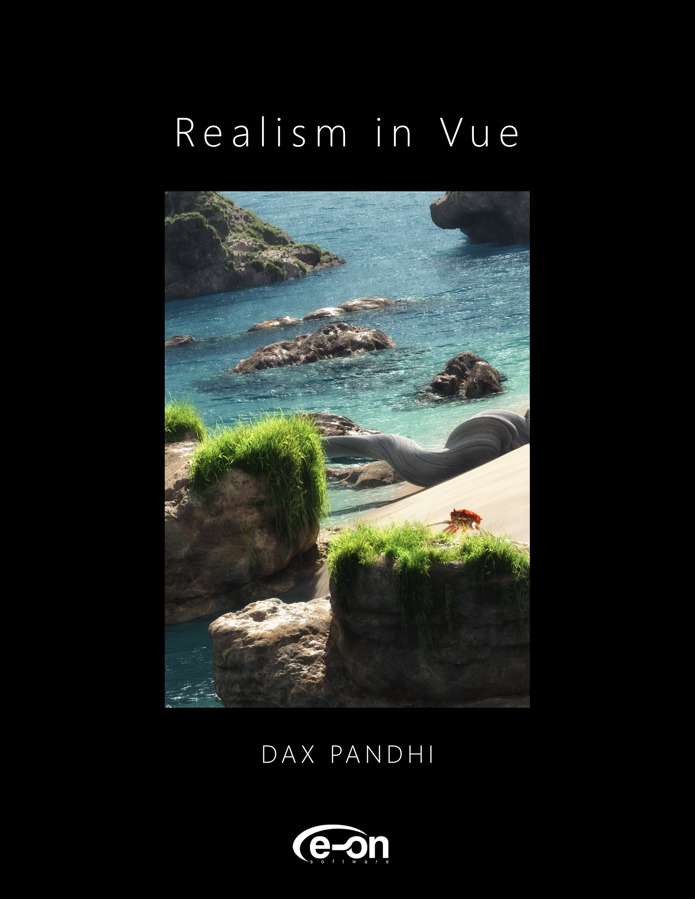
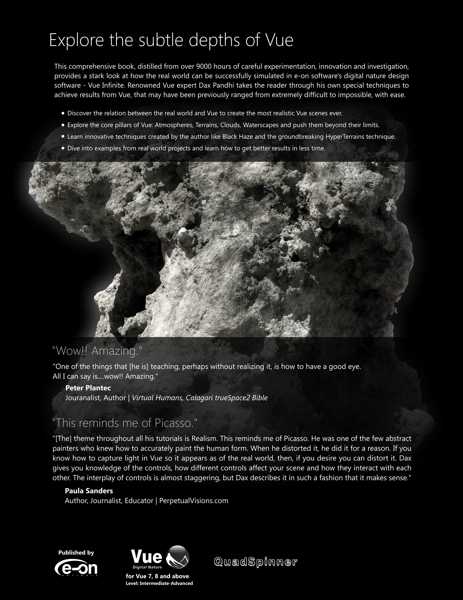

# Realism in Vue: Open Sourced for the Community

This version of the book has been open sourced to provide educational purposes by the author. This book was published nearly a decade ago, so please keep in mind that the software Vue has changed in some ways, and certain obsolete methodology may not apply. However, the core concepts still hold true.

NOTE: This book is provided "as-is" without technical support.

The original print edition was published by E-on Software.

> *"It didn't take long to realize that the best guy on the planet is Dax Pandhi. his understanding of real world environments and terrains blow the doors off of anyone I've ever seen. The guy is simply amazing. He is a weapons grade talent."*

**Doug Drexler**

VES, Emmy, and Academy winning artist (*Battlestar Galactica, Star Trek: The Next Generation, Star Trek: Deep Space Nine*)

# Realism in Vue

Realism in Vue takes a fundamental look at how nature works and interprets those rules into the Vue paradigm. Covering the core pillars of nature found in Vue – Atmosphere, EcoSystem, HyperTerrain, Material, and Terrain – this approach will dramatically increase your practical knowledge of and confidence in the technology. Dax reveals new techniques and also upgraded versions of existing techniques that continue to empower professional Hollywood artists. The unique chapter on Perception and its vital role will give your renders that often elusive ‘something special’.

Based on real production scenarios, Realism in Vue places great emphasis on achieving superior realism within budget and time constraints. All examples shown throughout the book are taken from actual projects. A special section is dedicated to developing custom render settings for significantly faster renders.

Additionally, the book is version agnostic – apart from a few features specific to certain versions of Vue, almost all techniques can be applied universally to most editions of Vue.

Realism in Vue contains hundreds of full color renders and is printed on glossy paper with a rigid paper cover. Order your copy now so you can take your work to a completely new level.
